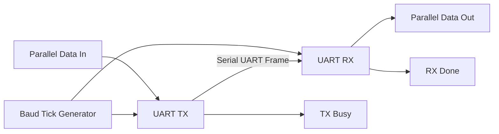
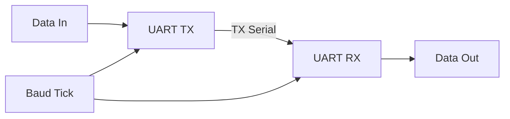
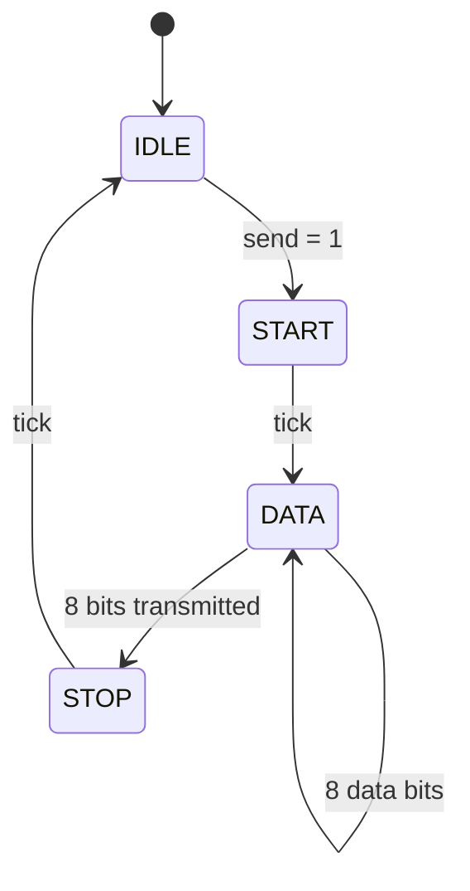
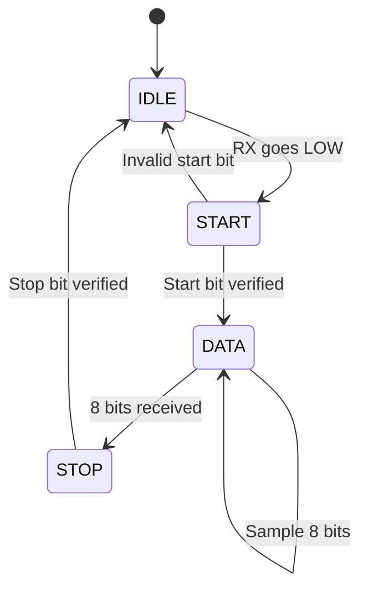
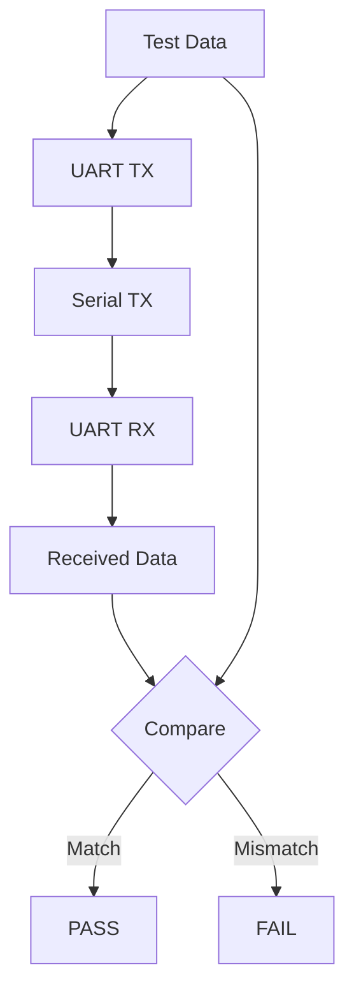

# UART RTL Design & Verification

> **8-bit UART transmitter and receiver designed in Verilog HDL and verified using Siemens Questa 2024.1.**


---

## 📌 Project Overview

This project implements a complete **8-bit UART communication system at RTL level**.

The design includes:

- 8-bit UART Transmitter
- 8-bit UART Receiver
- Baud/timing tick generator
- TX → RX serial loopback
- FSM-based control
- Shift-register based data transmission
- Self-checking testbench
- Multiple data-pattern verification
- Questa waveform analysis

The main objective was to understand both **RTL design** and **functional verification** using a professional HDL simulation environment.

---

## 🏗️ Architecture



### TX → RX Loopback

The serial output of the transmitter is internally connected to the receiver.



This allows the complete UART communication path to be verified without external hardware.

---

## 🔄 UART Frame Format

Each UART frame contains:

| Field | Size | Description |
|---|---:|---|
| Idle | 1 | UART line remains HIGH |
| Start Bit | 1 bit | LOW indicates beginning of frame |
| Data | 8 bits | Payload transmitted LSB first |
| Stop Bit | 1 bit | HIGH indicates end of frame |

### Example: `41h`

`41h = 01000001`

UART transmits the data **LSB first**:

```text
Start     Data Bits (LSB → MSB)        Stop
  0       1  0  0  0  0  0  1  0       1
  │       └─────────────────────┘       │
  │               41h                   │
  └────────── Frame Start ──────────────┘
```

---

## 🧩 RTL Modules

| Module | Purpose |
|---|---|
| `baud_tick.v` | Generates the timing tick used by TX/RX |
| `uart_tx.v` | Converts 8-bit parallel data into serial UART data |
| `uart_rx.v` | Samples serial data and reconstructs the original byte |
| `uart_top.v` | Connects TX and RX for loopback operation |
| `uart_top_tb.v` | Self-checking testbench for automated verification |

---

## ⚙️ Transmitter FSM



### Transmitter Operation

The transmitter:

1. Waits in `IDLE`.
2. Detects `send`.
3. Loads the input byte into a shift register.
4. Generates the start bit.
5. Sends 8 data bits **LSB first**.
6. Generates the stop bit.
7. Returns to `IDLE`.

A shift register is used to serialize the parallel input data.

---

## ⚙️ Receiver FSM



### Receiver Operation

The receiver:

1. Waits for the UART line to go LOW.
2. Detects the start bit.
3. Verifies the start bit.
4. Samples the 8 data bits.
5. Reconstructs the original byte.
6. Checks the stop bit.
7. Produces the received data and completion pulse.

---

## ⏱️ Simulation Parameters

| Parameter | Value |
|---|---:|
| System Clock | 10 MHz |
| Clock Period | 100 ns |
| Timing Tick | 1 MHz |
| Tick Period | 1 µs |
| Data Width | 8 bits |
| Start Bits | 1 |
| Data Bits | 8 |
| Stop Bits | 1 |

> **Note:** The timing values are intentionally simplified for RTL simulation and learning. They are not intended to represent a standard UART baud rate such as 9600 or 115200 baud.

---

## 🧪 Verification Strategy

The testbench uses an **automated self-checking verification approach**.



Instead of manually checking every waveform, the testbench automatically compares the transmitted byte with the received byte.

---

## 🔍 Test Cases

| Test | Transmitted | Received | Purpose |
|---:|---:|---:|---|
| 1 | `41h` | `41h` | Normal data pattern |
| 2 | `55h` | `55h` | Alternating bits |
| 3 | `AAh` | `AAh` | Inverse alternating bits |
| 4 | `00h` | `00h` | All zeros |
| 5 | `FFh` | `FFh` | All ones |

### Verification Result

```text
PASS: Sent = 41, Received = 41
PASS: Sent = 55, Received = 55
PASS: Sent = aa, Received = aa
PASS: Sent = 00, Received = 00
PASS: Sent = ff, Received = ff

------------------------------
ALL TESTS COMPLETED
------------------------------

Result: 5/5 test cases passed
```

---

# 📊 Simulation Results

## 1. Complete UART Loopback


The loopback waveform demonstrates the complete communication path:

**Data In → UART TX → Serial TX → UART RX → Data Out**

It shows multiple transactions including:

`41h → 55h → AAh → 00h → FFh`

The received data matches the transmitted data for every test case.

---

## 2. UART Transmitter


The transmitter waveform demonstrates:

- Input byte `41h`
- `send` initiating transmission
- UART start bit
- 8-bit serial transmission
- LSB-first data ordering
- Stop bit
- `busy` indicating active transmission
- `done` indicating completion

---

## 3. UART Receiver


The receiver waveform demonstrates:

- Serial RX input
- Start-bit detection
- Data-bit sampling
- Reconstruction of the 8-bit byte
- Received data `41h`
- `done` completion pulse

---

## 4. Automated Verification Output


The Questa transcript shows the self-checking testbench automatically comparing transmitted and received data.

**All 5 test patterns passed successfully.**

---

## 📁 Repository Structure

```text
uart-rtl-verification/
│
├── rtl/
│   ├── baud_tick.v
│   ├── uart_tx.v
│   ├── uart_rx.v
│   └── uart_top.v
│
├── tb/
│   └── uart_top_tb.v
│
├── doc/
│   ├── uart_loopback.png
│   ├── uart_tx.png
│   ├── uart_rx.png
│   └── verification_results.png
│
├── .gitignore
└── README.md
```

---

## 🛠️ Tools & Technologies

| Category | Technology |
|---|---|
| HDL | Verilog HDL |
| RTL Design | FSM, Sequential Logic, Shift Registers |
| Simulation | Siemens Questa 2024.1 |
| Verification | Self-Checking Testbench |
| Debugging | Questa Waveform Viewer |
| Version Control | Git |
| Repository | GitHub |

---

## 🎯 Key Concepts Demonstrated

```text
RTL Design
    ↓
UART Protocol
    ↓
FSM Design
    ↓
Shift Registers
    ↓
Serial Communication
    ↓
TX/RX Loopback
    ↓
Testbench Development
    ↓
Self-Checking Verification
    ↓
Waveform Debugging
```

### Core Skills

- Verilog RTL design
- Finite State Machines
- UART protocol
- Serial communication
- Parallel-to-serial conversion
- Serial-to-parallel conversion
- Shift registers
- Timing generation
- Testbench development
- Self-checking verification
- Waveform-based debugging
- Questa simulation

---

## 🚀 Future Improvements

The project can be extended with:

- Standard baud rates such as 9600 and 115200
- Configurable baud-rate generator
- Parameterized data width
- Parity-bit support
- Framing-error detection
- SystemVerilog assertions
- Functional coverage
- Code coverage
- Constrained-random verification
- SystemVerilog verification environment
- UVM-based UART verification

## 👨‍💻 Author

### Sandeep C

**B.Tech ECE | VLSI | RTL Design | Functional Verification**

Interested in:

`RTL Design` • `Digital Design` • `VLSI` • `Functional Verification`

---

## ⭐ Project Summary

This project demonstrates the complete development and verification of an **8-bit UART RTL system**, from RTL design and FSM implementation to automated verification and waveform debugging using **Siemens Questa 2024.1**.

**5/5 test cases passed successfully. ✅**
